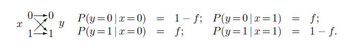
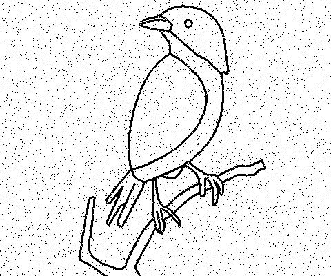
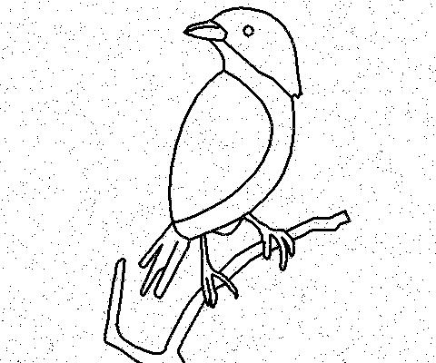
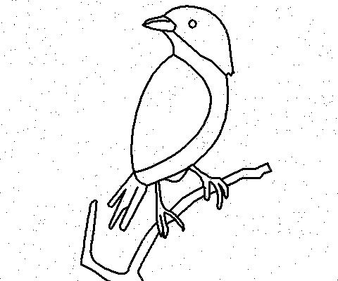
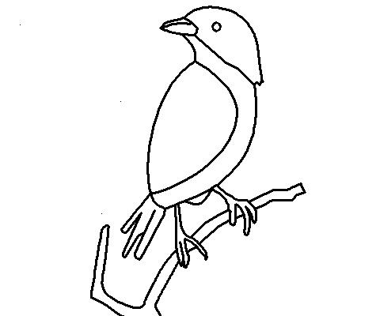

# Simple Communication System over BSC
## Introduction

The fundamental problem of communication is that of reproducing at one point either exactly or approximately a message selected at another point. (Claude Shannon, 1948)

Most communication channels are noisy. A telephone line suffers from cross-talk with other lines; the hardware in the line distorts and adds noise to the transmitted signal. A disk drive, which writes a binary digit may later fail to read out the stored binary digit, frames may be either damaged or lost completely in transit.
In all these cases, there is some probability that the received message will not be identical to the transmitted message. We would prefer to have a communication channel for which this probability was zero or so close to zero that for practical purposes it is indistinguishable from zero.

## Binary Symmetric Channel (BSC)

Let's consider a noisy disk drive that transmits each bit correctly with probability (1 - f) and incorrectly with probability f. This model communication channel is known as the binary symmetric channel. As an example, let's imagine that f = 0.1, that is, ten per cent of the bits are flipped. A useful disk drive would flip no bits at all in its entire lifetime. If we expect to read and write a gigabyte per day for ten years, we require a bit error probability of the order of 10^15, or smaller.

BSC: The transmitted symbol is x and the received symbol is y. 

To achieve this goal, there are two approaches, the physical solution and the ‘system’ solution. The physical solution is to improve the physical characteristics of the communication channel to reduce its error probability. We could improve our disk drive by using more reliable components in its circuitry or evacuating the air from the disk enclosure so as to eliminate the turbulence that perturbs the reading head from the track.
But with ‘system’ solution, we accept the given noisy channel as it is and add communication systems to it so that we can detect and correct the errors introduced by the channel.
 

However, physical solutions give incremental channel improvements only at an ever-increasing cost, system solutions can turn noisy channels into reliable communication channels with the only cost being a computational requirement at the encoder and decoder.

## Aims and Objective
This study aims to achieve the following:
* Implement a simple communication system over BSC
* Demonstrate that, over a noisy channel, error probability can be reduced using repetition codes R3, R5, etc
* Show that using R3 to transmit 10,000 binary sequence over BSC, we only experience at most 3% of the bits flipped.
* Visualize the effect of the bits flipped on a bitmap image when transmitted over the channel.
* Demonstrate the decrease in error probability as the number of repetition increases.

## Our Methods

The encoder encoded the source message `s` into a transmitted message `t`, adding redundancy to the original message in some way. The channel added noise to the transmitted message, yielding a received message `r`. The decoder used the known redundancy introduced by the encoding system to infer both the original signal `s` and the added noise.

### Repetition codes
* The idea was to repeat every bit of the message a prearranged number of times, for example three times, We called this repetition code `R3'. Then we used the majority vote algorithm to decode the received vector, three bits at a time.

## Implementation (Python)
### Section One:
Transmitting 10,000 binary sequence over the channel.
* Source message (s): 625 random 16 bits binary numbers were generated between 0 and 9999. To form the source message of 10,000 bits.
* Transmitted message (t): using repetition code, each bit was repeated 3 times to obtain the transmitted message.
* Sparse noise (n) was generated with an error rate of f=0.1
* The received string (r) = transmitted t + noise n, was decoded using the majority vote algorithm, and the received message `s-prime` was obtained.
* We finally computed the differences (number of bits flipped) between the source message (s) and the received message (s-prime)
* The result confirmed that less that 3% of the bits got flipped, that is resulted in error.
* You can check out the python implementation here: [bin_sys_channel.py](https://github.com/4DigitalMind/binary_symmetric_channel/blob/master/bin_sys_channel.py)

### Section Two:
Transmitting bitmap image over the channel.
* Source Message (s): Converted source image into binary string. This was done by iterating through the image pixels, representing black(0,0,0) as 0 and white(255,255,255) as 1.
* Transmitted message (t): also obtained using repetition code. We started with R3, then R5,R7,R9 up to R27 and the output of the channel got more and more reliable in that order.
* The received sequence(r) = transmitted t + noise n, was decoded using the majority vote algorithm, and the received image `s-prime` was obtained.
* We computed and compared the likelihood P(s|r). And the differences in the transmitted bitmap image and the received image could also be visually noticed.
* The implementation code in python can be accessed here: [bsc_bitmap_image.py](https://github.com/4DigitalMind/binary_symmetric_channel/blob/master/bsc_bitmap_image.py)

## Result and Discussion
* Section One: It was observed that the transmission of 10,000 binary sequence over the channel without repetition code resulted in 1038 bits flipped, which obeyed the error probability of f=0.1 (10%), and a repetition code of R3 reduced the error to 269 bits - equivalent to 2.69%. As the order of the repetition code increases, the error probability tends to zero.
* Section Two: Figure F-R0 shows the source image while F-R3, F-R5, F-R7, etc. shows the result of transmitting a binary image over a binary symmetric channel using the repetition code R3, R5, R7, etc. The effect of the bits flipped is easily visualized from the quality of the image. As the repetition code increases, the system produce more reliable output.

F-R0 F-R3 F-R5
 

F-R7 F-R9 F-R17

# Conclusion

The repetition code R3, R5, R7, etc. has therefore reduced the probability of error, as desired. Yet we have lost something: our rate of information transfer has fallen by a factor of the repetition, rate of R3 has fallen by three, R5 by five, and R7 by seven, in that order. So if we use a repetition code to communicate data over a telephone line, it will reduce the error frequency, but it will also reduce our communication rate. We will have to pay three or more times as much for each phone call. Similarly, we would need three or more of the original noisy gigabyte disk drives in order to create a one-gigabyte disk drive with pb <= 0:03.

However, we can communicate with tiny probability and at substantial rate over a BSC using other error correcting codes such as Hamming code. This is only a simulation program developed to study the performance of repetition codes as error correcting code over binary symmetric channels.

# Reference
* David J. C. MacKay, Information Theory, Inference & Learning Algorithms, Cambridge University Press, New York, NY, 2002
